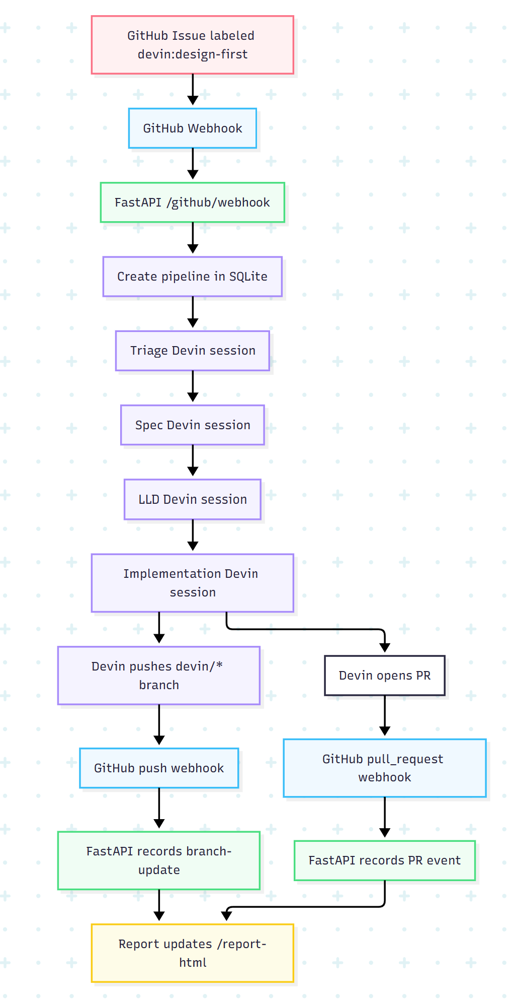

# Devin Design Gate



Minimal FastAPI + LangGraph orchestrator for a design-gated Devin remediation workflow.

## Run (Docker)

The recommended way to run this project is using Docker Compose.

```bash
cp .env.example .env
# edit .env locally; do not commit it
docker-compose up -d --build
```

The image excludes `.env`, logs, SQLite files, and local runtime artifacts via `.dockerignore`. Compose loads `.env` at runtime and persists SQLite under `./data`.

Minimum local `.env` for simulation:

```text
TARGET_REPO=your-user/your-fork
GITHUB_TOKEN=
DEVIN_API_KEY=dummy
DEVIN_API_BASE_URL=https://api.devin.ai
MOCK_DEVIN=true
PUBLIC_WEBHOOK_URL=
GITHUB_WEBHOOK_ID=
```

## Run (Local Python)

```bash
cp .env.example .env
# edit .env with GITHUB_TOKEN, TARGET_REPO, and PUBLIC_WEBHOOK_URL
pip install -r requirements.txt
uvicorn app:app --reload
```

## Cloudflare Tunnel

Quick Cloudflare tunnels change URL every time they restart.

```bash
cloudflared tunnel --url http://localhost:8000
```

On Windows, use the smart runner:

```powershell
.\run.ps1
```

It restarts FastAPI, checks whether the current Cloudflare URL still works, and only creates a new tunnel when needed. When a new tunnel is created, it writes `PUBLIC_WEBHOOK_URL` to `.env` and tries to update the matching GitHub webhook payload URL. If that GitHub update fails, it logs the manual Payload URL to use. Set `GITHUB_WEBHOOK_ID` in `.env` if the repo has multiple `/github/webhook` hooks.

When cloudflared prints a new URL, set this in `.env`:

```bash
PUBLIC_WEBHOOK_URL=https://your-current-cloudflare-url.trycloudflare.com/github/webhook
```

Then update the GitHub webhook Payload URL to the same value:

```text
https://your-current-cloudflare-url.trycloudflare.com/github/webhook
```

In GitHub webhook settings, enable `Issues` events. Re-adding the `devin:design-first` label sends an `issues.labeled` event and triggers the pipeline again.

Enable `Pushes` and `Pull requests` too if you want `/report-html` to update when Devin pushes more commits to a `devin/*` branch or synchronizes a pull request.

## Health

```bash
curl http://localhost:8000/health
```

Browser URLs:

```text
http://localhost:8000/health
http://localhost:8000/github/webhook
http://localhost:8000/report-html
http://localhost:8000/docs
```

With the current Cloudflare tunnel, replace the host with your latest tunnel base URL:

```text
https://your-current-cloudflare-url.trycloudflare.com/health
https://your-current-cloudflare-url.trycloudflare.com/github/webhook
https://your-current-cloudflare-url.trycloudflare.com/report-html
https://your-current-cloudflare-url.trycloudflare.com/docs
```

What each URL does:

```text
/health         Confirms the app is running and shows TARGET_REPO and MOCK_DEVIN.
/github/webhook Browser-safe status page for the webhook endpoint. GitHub must POST here.
/report-html    Shows the HTML pipeline report with sessions, stages, PRs, and branch updates.
/report.json    Returns the raw stored pipeline runs and stage history as JSON.
/check          Reconciles the report with open upstream PRs from this fork's `devin/*` branches.
/docs           FastAPI interactive API page for trying endpoints manually.

The `/report-html` page includes a 30-second countdown and calls `/check` automatically until a Devin PR is found.
```

## Test GitHub token can comment

Use a real issue number in your fork.

```bash
curl -X POST http://localhost:8000/github/comment-test ^
  -H "Content-Type: application/json" ^
  -d "{\"issue_number\":1}"
```

## Simulate With Docker

Set `MOCK_DEVIN=true` in `.env`, start Docker, then trigger a fake run:

```bash
docker-compose up -d --build
curl -X POST http://localhost:8000/simulate \
  -H "Content-Type: application/json" \
  -d '{"issue_number":1,"issue_title":"Reports: preserve actionable failure reason when scheduled report execution fails","issue_body":"Operators need actionable failure reasons."}'
```

Open `http://localhost:8000/report-html`. The latest run is highlighted, and the report checks for new stages, pushes, and PRs every 30 seconds.

## Report

```bash
curl http://localhost:8000/report-html
curl http://localhost:8000/report.json
```

## Label Trigger Flow

When GitHub sends `POST /github/webhook` with:

```text
X-GitHub-Event: issues
action: labeled
label.name: devin:design-first
```

the app starts the design-gated pipeline:

```text
triage -> spec -> lld -> implementation -> verification
```

Each stage is saved to SQLite and appears in `/report-html`. Because the app does not dedupe labeled events, removing `devin:design-first` and adding it again starts another full run.

Push webhooks for branches named `devin/*` and pull request `synchronize` webhooks are recorded as extra report events on the latest pipeline for that repo. The report links to the compare URL or PR so you can see when Devin pushed a new change after the initial run.

If GitHub missed a webhook or the app was offline when a PR was opened, call:

```bash
curl http://localhost:8000/check-and-update-report
```

This scans open PRs in `UPSTREAM_REPO` or `apache/superset`, finds PRs whose head repo is `TARGET_REPO` and branch starts with `devin/`, then updates `/report-html`. The short alias `/check` and typo-compatible `/chec-and-update-report` work too.

Keep `MOCK_DEVIN=true` until GitHub comments, SQLite, `/simulate`, and `/report-html` all work.
